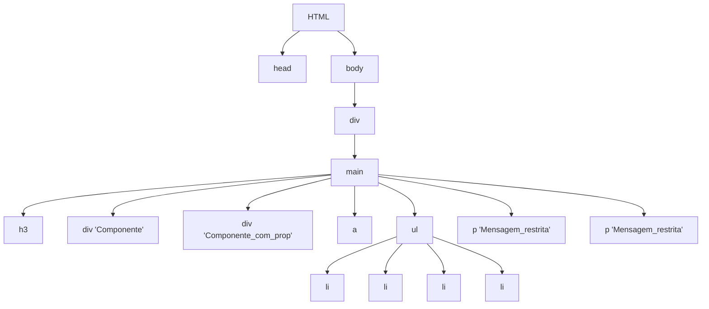

```mermaid
  flowchart TD
  html[ HTML ] --> head[ head ]
  html[ HTML ] --> body[ body ]
  body[ body ] --> div[ div ]
  div[ div ] --> main[ main ]
  main[ main ] --> h3[ h3 ]
  main[ main ] --> div2[ div 'Componente' ]
  main[ main ] --> div3[ div 'Componente_com_prop' ]
  main[ main ] --> a[ a ]
  main[ main ] --> ul[ ul ]
  ul[ ul ] --> li[ li ]
  ul[ ul ] --> li2[ li ]
  ul[ ul ] --> li3[ li ]
  ul[ ul ] --> li4[ li ]
  main[ main ] --> p[ p 'Mensagem_restrita' ]
  main[ main ] --> p2[ p 'Mensagem_restrita' ]

```